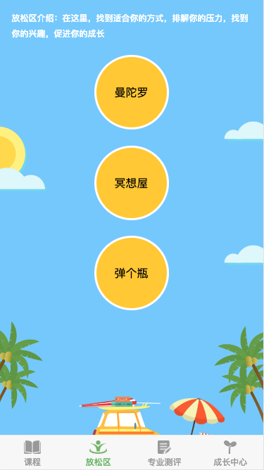
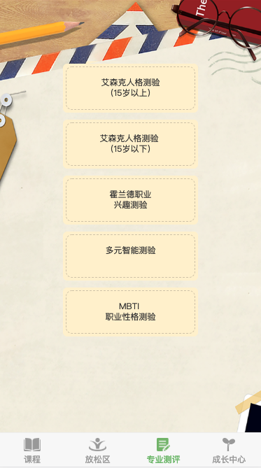
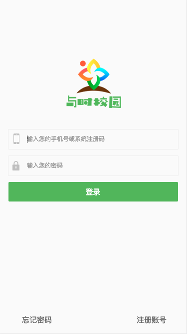
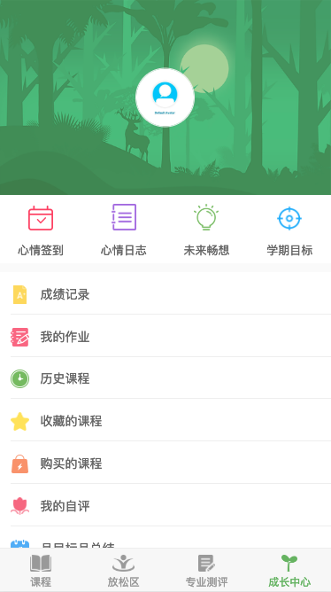
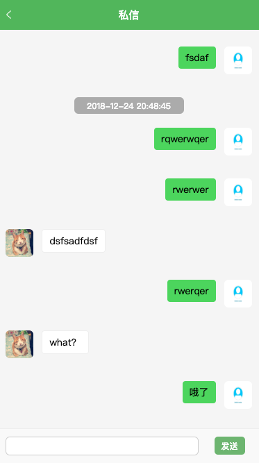

# 与时校园  Mobile站

#### 介绍
**与时校园**
本代码由displayLi贡献，**禁止商业用途**，转载请联系QQ 463961434，并注明来源
  **本代码最终解释权归 LINK+创意工作室 所有**

#### 软件架构
Vue + WebSocket + konva

#### 安装教程

1. yarn     
2. yarn dev
3. yarn build 

#### 参与贡献

1. display li
2. Li yun xi

#### DEMO

